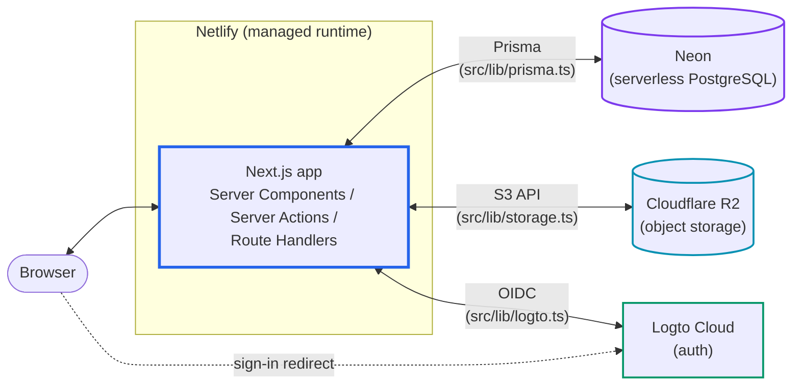

# Architecture

For the design rules that govern where new code should land (roles, concepts,
dependency direction), see [`docs/design.md`](design.md).

## One deployable, two tiers

There is a single deployable: the Next.js app. Both tiers — server (Server
Components, Server Actions, route handlers) and client (browser bundle) — live in
the same `src/` tree, and the boundary between them is drawn by `'use client'`
directives and the directory roles in [`design.md`](design.md), not by separate
processes.

Everything stateful is a managed cloud service (Neon, R2, Logto). The app itself
holds no state, so there is no Docker and no infrastructure to run: locally the app
runs on the host (`pnpm dev`), in production on Netlify's managed runtime.
Production and development always use separate Neon / R2 / Logto instances — see
the [README](../README.md#environments-prod--dev-separation) for how credentials
are supplied per environment.

## Directories

Key directories only — not exhaustive.

- `src/` — the application; one directory per role (see
  [`design.md`](design.md#roles))
  - `app/` — Next.js routing: pages, layouts, route handlers
  - `components/` — UI building blocks
  - `server/` — domain logic: Prisma queries, R2 operations, Server Actions
  - `services/` — client-side HTTP layer toward this app's own route handlers
  - `lib/` — external-service clients (Prisma/Neon, R2, Logto)
  - `types/` — types shared between server and client code
  - `utils/` — pure, domain-agnostic helpers shared between server and client code
  - `generated/` — Prisma client output (git-ignored; `prisma generate`)
- `prisma/` — Prisma schema and migrations
- `public/` — static assets served as-is
- `.github/workflows/` — CI (format / lint / typecheck / unit); deploys are Netlify's
  GitHub integration, not workflows in this repo
- `cmd` — entry point for repo utilities (`./cmd` for the command reference)
